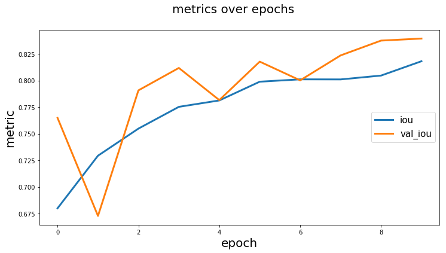
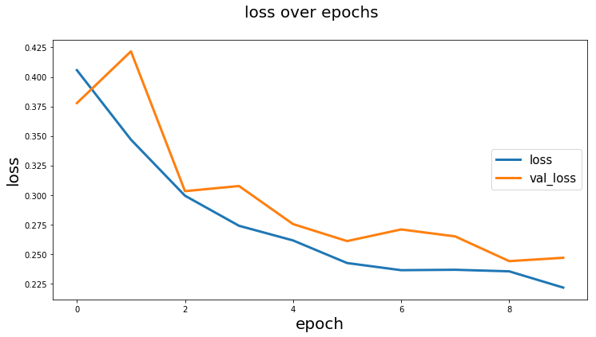
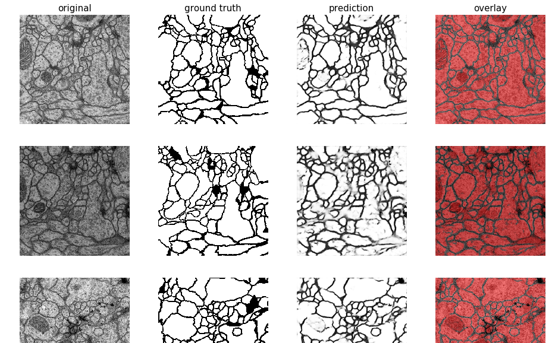
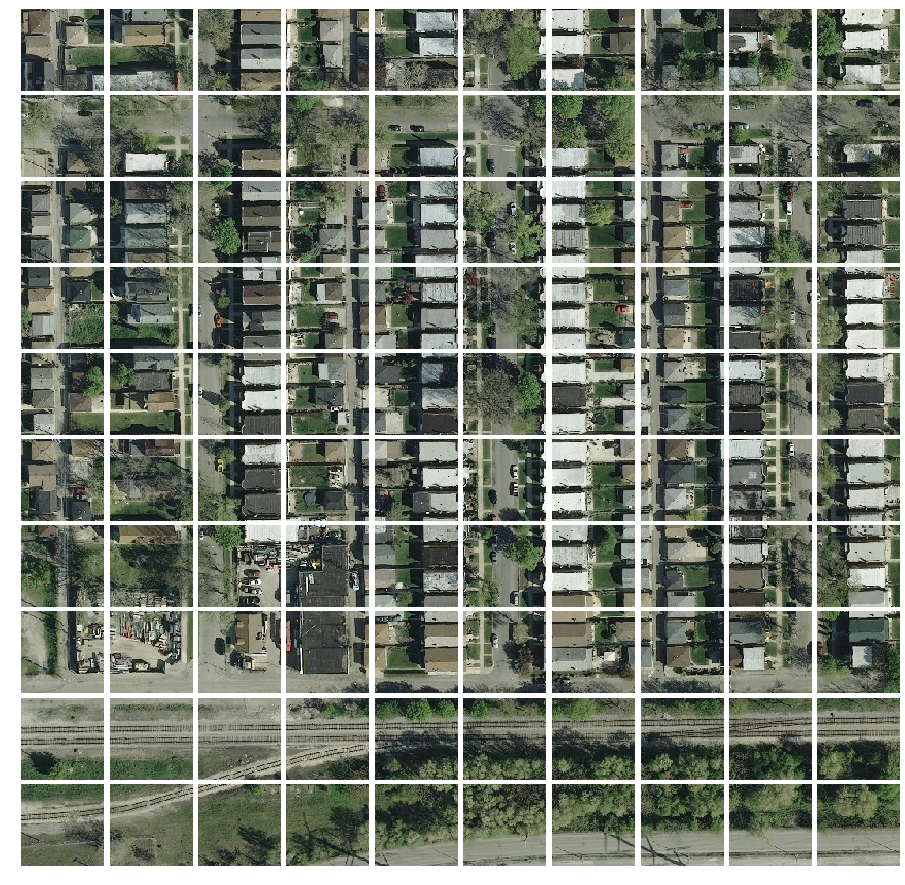
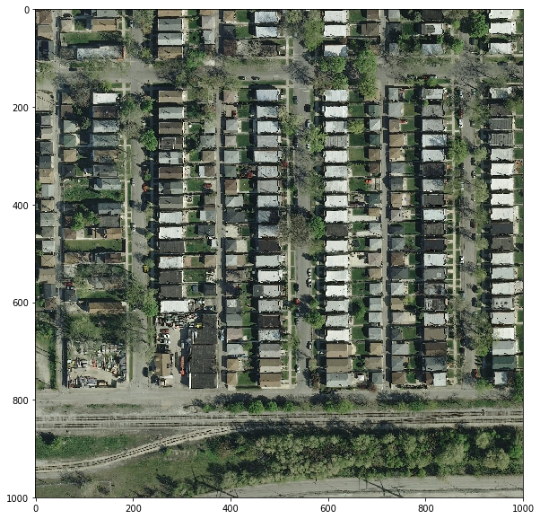

# About
Helpers package for semantic segmentation tasks using U-Net models implemented in Keras.

# Features:           
- [x] Vanilla U-Net implementation based on [the original paper](https://arxiv.org/pdf/1505.04597.pdf)
- [x] Customizable U-Net:
    - [x] batch norm or/and dropout
    - [x] number of starting filters
    - [x] number of "unet" conv layers
- [x] U-Net optimized for satellite images based on [DeepSense.AI Kaggle competition entry](https://deepsense.ai/deep-learning-for-satellite-imagery-via-image-segmentation/)
- [x] Utils:
    - [x] Plotting images and masks
    - [x] Plotting images masks and predictions with overlay (prediction on top of original image)
    - [x] Plotting training history
    - [x] Data augmentation helper function
- [x] Notebooks (examples):
    - [x] Training custom U-Net for whale tails segmentation example
    - [ ] Semantic segmentation for satellite images
    - [x] Semantic segmentation for medical images

# Installation:
```bash
pip install git+https://github.com/karolzak/keras-unet
```

# Usage examples:

- U-Net implementations in Keras:  
    - [Vanilla U-Net](#Vanilla-U-Net)  
    - [Customizable U-Net](#Customizable-U-Net)  
    - [U-Net for satellite images](#U-Net-for-satellite-images)    
- Utils:
    - [Plot training history](#Plot-training-history)  
    - [Plot images and segmentation masks](#Plot-images-and-segmentation-masks)  
    - [Get smaller patches/crops from bigger image](#Get-smaller-patches/crops-from-bigger-image)    
    - [Plot small patches into single big image](#Plot-small-patches-into-single-big-image)  
    - [Reconstruct a bigger image from smaller patches/crops](#Reconstruct-a-bigger-image-from-smaller-patches/crops)


### Vanilla U-Net

[work in progress]

```python
from keras_unet.models import unet_vanilla

model = unet_vanilla.unet_vanilla(input_shape=(512,512,3))
```

[[back to usage examples]](#usage-examples)

### Customizable U-Net 

[work in progress]

```python
from keras_unet.models import unet

model = unet.unet(
    input_shape=(512,512,3),
    use_batch_norm=False,
    num_classes=1,
    filters=64,
    dropout=0.2,
    output_activation='sigmoid')
```
[[back to usage examples]](#usage-examples)

### U-Net for satellite images

[work in progress]
```python
from keras_unet.models import unet_satellite

model = unet_satellite.unet_satellite(input_shape=(512,512,3))
```

[[back to usage examples]](#usage-examples)

### Plot training history 

```python
history = model.fit_generator(...)

from keras_unet.utils import plot_segm_history

plot_segm_history(
    history, # required - keras training history object
    metrics=['iou', 'val_iou'], # optional - metrics names to plot
    losses=['loss', 'val_loss']) # optional - loss names to plot
```

Output:    



[[back to usage examples]](#usage-examples)

### Plot images and segmentation masks

```python
from keras_unet.utils import plot_imgs

plot_imgs(
    org_imgs=x_val, # required - original images
    mask_imgs=y_val, # required - ground truth masks
    pred_imgs=y_pred, # optional - predicted masks
    nm_img_to_plot=9) # optional - number of images to plot
```

Output:    



[[back to usage examples]](#usage-examples)

### Get smaller patches/crops from bigger image

```python
from PIL import Image
import numpy as np
from keras_unet.utils import get_patches

x = np.array(Image.open("../docs/sat_image_1.jpg"))
print("x shape: ", str(x.shape))

x_crops = get_patches(
    img_arr=x, # required - array of images to be cropped
    size=100, # default is 256
    stride=100) # default is 256

print("x_crops shape: ", str(x_crops.shape))
```

Output:
```output
x shape:  (1000, 1000, 3)   
x_crops shape:  (100, 100, 100, 3)
```


[[back to usage examples]](#usage-examples)

### Plot small patches into single big image

```python
from keras_unet.utils import plot_patches
   
print("x_crops shape: ", str(x_crops.shape))         
plot_patches(
    img_arr=x_crops, # required - array of cropped out images
    org_img_size=(1000, 1000), # required - original size of the image
    stride=100) # use only if stride is different from patch size
```

Output:     
```output
x_crops shape:  (100, 100, 100, 3)
```


[[back to usage examples]](#usage-examples)

### Reconstruct a bigger image from smaller patches/crops 

```python
import matplotlib.pyplot as plt
from keras_unet.utils import reconstruct_from_patches

print("x_crops shape: ", str(x_crops.shape))

x_reconstructed = reconstruct_from_patches(
    img_arr=x_crops, # required - array of cropped out images
    org_img_size=(1000, 1000), # required - original size of the image
    stride=100) # use only if stride is different from patch size

print("x_reconstructed shape: ", str(x_reconstructed.shape))

plt.figure(figsize=(10,10))
plt.imshow(x_reconstructed[0])
plt.show()
```
Output:    
```output
x_crops shape:  (100, 100, 100, 3)
x_reconstructed shape:  (1, 1000, 1000, 3)
```


[[back to usage examples]](#usage-examples)

